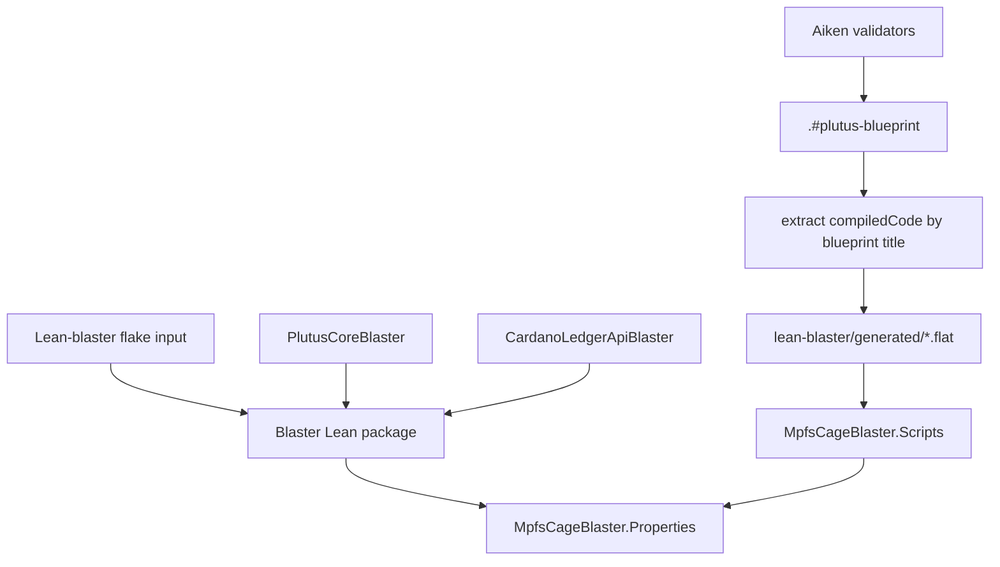

# Blaster UPLC Properties

The `lean-blaster/` project checks properties against the compiled Plutus V3
UPLC produced from the Aiken validators. It complements the abstract Lean
model in `lean/`: the abstract model states protocol invariants, while Blaster
checks that selected invariants still hold after Aiken compilation.

## What Is Checked

The bridge imports three generated blueprint entrypoints:

| Blueprint title | Lean name | Purpose |
|---|---|---|
| `state.state.mint` | `appliedMpfStateMint` | Global state policy mint, migrate, and burn paths |
| `state.state.spend` | `appliedMpfStateSpend` | State UTxO `Modify` and `End` paths |
| `request.request.spend` | `appliedMpfRequestSpend` | Request UTxO `Contribute`, `Retract`, and `Sweep` paths |

The current properties are in
[`lean-blaster/MpfsCageBlaster/Properties.lean`](https://github.com/cardano-foundation/cardano-mpfs-onchain/blob/main/lean-blaster/MpfsCageBlaster/Properties.lean).
They cover the compiled redeemer dispatch surface:

- state-policy minting accepts only `Minting`, `Migrating`, or `Burning`;
- state spending accepts only `End` and `Modify`;
- request spending accepts only `Contribute`, `Retract`, and `Sweep`;
- datum/redeemer mismatches fail on the validator that does not own them;
- `End` and `Modify` require the state owner signature;
- `Retract` requires the request owner signature.

The properties intentionally use raw `Data` patterns for datum and redeemer
shapes. That keeps the checks close to the ledger encoding and avoids trusting
an additional typed decoder in front of the compiled UPLC.

## Nix Build Graph

The flake pins the Blaster toolchain and exposes `.#mpfs-cage-blaster`.



`flake.nix` does the extraction inside a derivation:

1. build the Aiken blueprint in the Nix sandbox;
2. select the three validator titles with `jq -er`;
3. write normalized CBOR hex into `generated/*.flat`;
4. substitute the generated store paths into `Scripts.lean`;
5. build the Lean package with Blaster and Z3 available.

Using `jq -er` is deliberate: if a validator is renamed or removed from the
blueprint, the derivation fails instead of producing an empty UPLC input.

## Commands

Build and verify the Blaster package:

```sh
nix build -L .#mpfs-cage-blaster
```

The same build is available through `just`:

```sh
just blaster-build
```

Regenerate local `lean-blaster/generated/*.flat` files for manual Lake work:

```sh
just blaster-generate
```

The generated files are ignored by git. They are only needed when developing
outside the Nix build, because the Nix package generates them in the store.

Check whether the Blaster package is already available from the local Nix store
or a configured substituter:

```sh
nix build --no-link --dry-run .#mpfs-cage-blaster
```

If the dry run reports nothing to build, the package closure is already cached
for the current inputs. If it lists derivations, those derivations are missing
from the local store and configured binary caches.

## Cache Expectations

The repository configures the IOG binary cache in `flake.nix`:

```nix
nixConfig = {
  extra-substituters = [ "https://cache.iog.io" ];
  extra-trusted-public-keys =
    [ "hydra.iohk.io:f/Ea+s+dFdN+3Y/G+FDgSq+a5NEWhJGzdjvKNGv0/EQ=" ];
};
```

That cache can supply shared dependencies such as Cardano and Haskell
artifacts. The MPFS-specific Blaster derivation is content-addressed by this
repository's source, the Aiken blueprint, and the pinned Blaster inputs. A
successful local or CI build puts it in that machine's Nix store; a shared
binary cache would be needed to make the project-specific result available to
other machines without rebuilding.

The practical smoke test for cacheability is:

```sh
nix build -L .#mpfs-cage-blaster
nix build --no-link --dry-run .#mpfs-cage-blaster
```

The second command should have no build plan when run against unchanged inputs
on the same machine.

## Adding A Property

1. Identify the compiled entrypoint that should enforce the claim:
   `appliedMpfStateMint`, `appliedMpfStateSpend`, or
   `appliedMpfRequestSpend`.
2. Add or reuse a `ScriptContext -> Prop` predicate in
   `Properties.lean`. Prefer predicates over raw ledger data when the claim is
   about what the validator sees.
3. State the theorem over the prepared UPLC property, for example:

   ```lean
   theorem request_spend_end_redeemer_errors :
       ∀ (statePolicyId cageTokenName : Data) (version : Integer)
         (ctx : ScriptContext),
         isEndRedeemer ctx →
         isUnsuccessful
           (appliedMpfRequestSpend.prop statePolicyId cageTokenName version ctx) := by
     blaster
   ```

4. Run `nix build -L .#mpfs-cage-blaster`.
5. If Blaster finds a counterexample, decide whether the property is too
   strong, the predicate does not model the ledger data shape correctly, or the
   validator needs a fix.

## Known Limits

Blaster emits warnings such as:

```text
declaration uses 'blasterProven' (SMT-verified, no proof term)
```

Those warnings are expected. They mean the theorem is discharged through
Blaster's SMT certificate path rather than by a Lean kernel proof term. Treat
these checks as compiled-code SMT properties, not as a replacement for the
abstract Lean proofs in `lean/` or the Aiken/Haskell test suites.

The current prep fuel is `500`, configured in
[`lean-blaster/MpfsCageBlaster/Scripts.lean`](https://github.com/cardano-foundation/cardano-mpfs-onchain/blob/main/lean-blaster/MpfsCageBlaster/Scripts.lean).
Raising the fuel may expose deeper UPLC reductions but also increases build
time.
