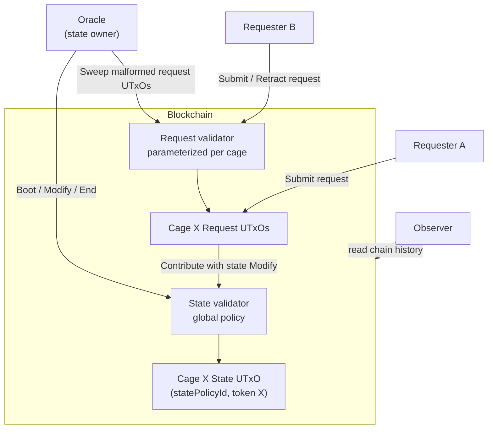
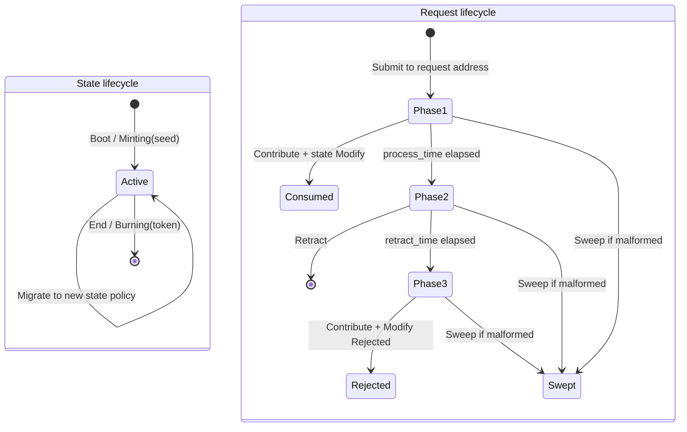

# Architecture Overview

## System Context

The on-chain validators are one half of the
[MPFS system](https://github.com/cardano-foundation/mpfs)
([documentation](https://cardano-foundation.github.io/mpfs/)).
They enforce the rules for creating, updating, cleaning up, and destroying
MPF-backed cage tokens on Cardano.

Issue #49 splits the cage into:

- a global **state validator** whose policy ID is the discovery anchor; and
- a parameterized **request validator** applied per cage with
  `(statePolicyId, cageToken)`.

The **oracle** controls the state UTxO through `State.owner`. Requesters
submit modification requests to the per-cage request address and can retract
them during Phase 2. Observers reconstruct state from chain history.

## Transaction Lifecycle

## Time-Gated Phases

Each request passes through three exclusive time phases, enforced with
`tx.validity_range`. Phase parameters come from the referenced state datum.

```mermaid
gantt
    title Request Time Phases
    dateFormat X
    axisFormat %s

    section Phases
    Phase 1 - Oracle Modify       :active, p1, 0, 10
    Phase 2 - Requester Retract   :crit, p2, 10, 20
    Phase 3 - Oracle Reject       :done, p3, 20, 30
```

| Phase | Window | Allowed operation | Actor |
|---|---|---|---|
| Phase 1 | `[submitted_at, submitted_at + process_time)` | `Modify(UpdateAction)` + `Contribute` | Oracle |
| Phase 2 | `[submitted_at + process_time, submitted_at + process_time + retract_time)` | `Retract` | Requester |
| Phase 3 | `[submitted_at + process_time + retract_time, ...)` | `Modify(Rejected)` + `Contribute` | Oracle |

A request with a dishonest future `submitted_at` is immediately rejectable by
the oracle.

## Operation Table

| Transaction | Validator path | Purpose |
|---|---|---|
| Boot | `state.mint(Minting(seed))` | Mint one cage token and create empty state |
| Submit | pay to `request(statePolicyId, cageToken)` | Lock a pending request |
| Modify | `state.spend(Modify(actions))` + `request.spend(Contribute(stateRef))` | Apply or reject matching requests |
| Retract | `request.spend(Retract(stateRef))` | Let requester reclaim a Phase 2 request |
| Sweep | `request.spend(Sweep(stateRef))` | Let state owner clean malformed request-address UTxOs |
| Migrate | old burn + `state.mint(Migrating(...))` | Move identity and root to a new validator |
| End | `state.spend(End)` + `state.mint(Burning(token))` | Destroy the cage token |

## Protocol Flow

```mermaid
sequenceDiagram
    participant O as Oracle
    participant B as Blockchain
    participant A as Alice
    participant C as Bob

    O->>B: Boot cage X with state Minting(seed)
    Note over B: State UTxO carries (statePolicyId, token X)

    A->>B: Submit Insert request to request(statePolicyId, X)
    C->>B: Submit Insert request to request(statePolicyId, X)

    rect rgb(40, 80, 40)
        Note over O,B: Phase 1
        O->>B: State Modify + request Contribute
        Note over B: Root updated and requesters refunded
    end

    C->>B: Submit Delete request
    rect rgb(80, 80, 40)
        Note over C,B: Phase 2
        C->>B: Retract with state as reference input
        Note over B: Request reclaimed, state unchanged
    end

    A->>B: Submit malformed matching-token request
    rect rgb(80, 40, 40)
        Note over O,B: Cleanup
        O->>B: Sweep malformed request with state owner signature
        Note over B: Legitimate processable requests remain protected
    end

    O->>B: End cage X with Burning(token X)
    Note over B: Token destroyed
```

## Security Properties

The validators enforce these core invariants:

1. Token IDs derive from consumed UTxOs.
2. State minting and burning move exactly one asset under the state policy.
3. State references are authenticated by both policy ID and asset name.
4. `Contribute` requires the state UTxO as a regular input spent with
   `Modify`.
5. `Retract` can use a reference state UTxO but requires the request owner.
6. State `Modify` preserves token, address, tip, and phase parameters.
7. MPF root updates are justified by Merkle proofs.
8. Request phase windows are exclusive.
9. Malformed request-address spam can be swept by the state owner.
10. Processable legitimate requests are protected from sweep.

The corresponding Lean model lives in
[`lean/MpfsCage/SplitValidators.lean`](https://github.com/cardano-foundation/cardano-mpfs-onchain/blob/main/lean/MpfsCage/SplitValidators.lean),
with phase proofs in
[`lean/MpfsCage/Phases.lean`](https://github.com/cardano-foundation/cardano-mpfs-onchain/blob/main/lean/MpfsCage/Phases.lean).

## Aiken Dependencies

| Dependency | Version | Purpose |
|---|---|---|
| [aiken-lang/stdlib](https://github.com/aiken-lang/stdlib) | v2.2.0 | Standard library |
| [aiken-lang/merkle-patricia-forestry](https://github.com/aiken-lang/merkle-patricia-forestry) | v2.0.0 | MPF trie operations and proof verification |
| [aiken-lang/fuzz](https://github.com/aiken-lang/fuzz) | v2.1.1 | Property-based testing |
