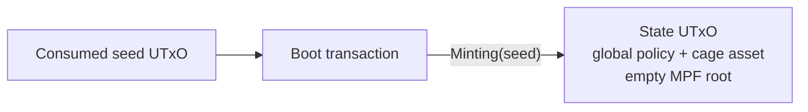
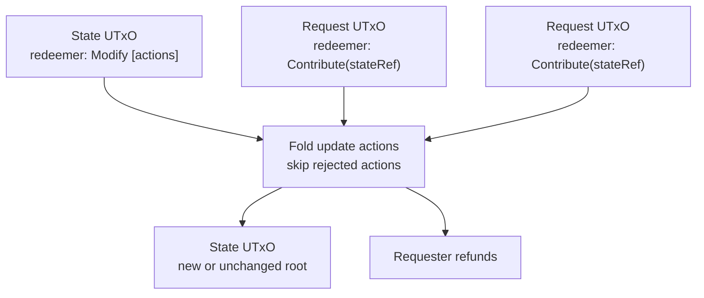

# Validators

The on-chain logic is split across two validator modules:

- [`state.ak`](https://github.com/cardano-foundation/cardano-mpfs-onchain/blob/main/validators/state.ak)
  defines the global state minting policy and the state UTxO spending rules.
- [`request.ak`](https://github.com/cardano-foundation/cardano-mpfs-onchain/blob/main/validators/request.ak)
  defines the per-cage request spending rules.

Shared predicates live in
[`shared.ak`](https://github.com/cardano-foundation/cardano-mpfs-onchain/blob/main/validators/shared.ak),
and token helpers live in
[`lib.ak`](https://github.com/cardano-foundation/cardano-mpfs-onchain/blob/main/validators/lib.ak).

## Validator Parameters

The state validator is unparameterized:

```aiken
validator state {
```

Its policy ID is the global discovery anchor for all cages of this
validator version. A specific cage is identified by the pair
`(statePolicyId, cageToken)`, where `cageToken` is the asset name minted
under the state policy.

The request validator is parameterized per cage:

```aiken
validator request(statePolicyId: PolicyId, cageTokenName: AssetName) {
```

| Parameter | Type | Description |
|---|---|---|
| `statePolicyId` | `PolicyId` | Policy ID of the global state validator |
| `cageTokenName` | `AssetName` | Asset name of the cage token handled by this request instance |

Wallets can derive the canonical request address from the audited request
blueprint plus `(statePolicyId, cageTokenName)`. Request spends then
authenticate the referenced state UTxO by checking that it carries exactly
one `(statePolicyId, cageTokenName)` token.

## State Minting Policy

### Boot (`Minting(seed)`)

Creates a new cage token under the global state policy.

Validation rules:

1. The `seed` `OutputReference` is consumed by the transaction.
2. The asset name is `assetName(seed)`.
3. The mint field contains exactly one asset under the state policy:
   `(policyId, assetName(seed)) = 1`.
4. No other asset under the state policy is minted or burned.
5. The first output is locked at the state script address.
6. The output datum is `StateDatum` with `root(empty)`.
7. The output value contains exactly one cage token.



### Migration (`Migrating(migration)`)

Carries a cage token identity forward from an old policy to the new global
state policy.

Validation rules:

1. Exactly one old token `(oldPolicy, tokenId)` is burned.
2. Exactly one new token `(statePolicyId, tokenId)` is minted.
3. No unrelated state-policy asset is moved.
4. The first output is locked at the new state script address.
5. The output carries `StateDatum`; the root may be non-empty.

### Burn (`Burning(tokenId)`)

Burns a cage token when paired with state spending redeemer `End`.

Validation rules:

1. The mint field contains exactly `-1` of `(statePolicyId, tokenId)`.
2. No unrelated asset under the state policy is moved.

## State Spending Validator

`state.spend` accepts only `StateDatum` inputs. The state owner must sign,
the spent input must be locked at the state validator's script credential,
and the input value must carry exactly one cage token under the state policy.

Accepted redeemers:

| Redeemer | Purpose |
|---|---|
| `Modify(List<RequestAction>)` | Process matching request inputs |
| `End` | Burn and destroy the cage token |

All other redeemers fail at the state address.

### Modify

The owner applies pending requests to the MPF trie. The transaction spends
the state UTxO with `Modify(actions)` and spends each request UTxO with the
request validator's `Contribute(stateRef)` redeemer.

Validation rules:

1. The owner signs the transaction.
2. The first output remains at the state script credential.
3. The first output carries exactly one same cage token.
4. `tip`, `process_time`, and `retract_time` are immutable.
5. Matching request inputs are those with `RequestDatum.requestToken` equal
   to the cage token.
6. Each matching request consumes one `RequestAction` in input order.
7. `UpdateAction(proof)` is allowed only in Phase 1 and folds the MPF proof
   into the root.
8. `Rejected` is allowed only for rejectable requests: Phase 3 or dishonest
   future `submitted_at`.
9. The output root equals the folded root.
10. Refund outputs pay request owners `total input lovelace - tx fee -
    n * state.tip`.



### End

Destroys the cage token instance.

Validation rules:

1. The owner signs the transaction.
2. The mint field burns exactly the cage token from the spent state input.
3. No unrelated asset under the state policy is moved.

## Request Spending Validator

`request(statePolicyId, cageTokenName).spend` accepts request-side operations
for one cage. It does not update the MPF state directly; it authenticates the
referenced state UTxO and enforces the request lifecycle rules.

Accepted redeemers:

| Redeemer | Purpose |
|---|---|
| `Contribute(OutputReference)` | Spend a request with state `Modify` |
| `Retract(OutputReference)` | Let the request owner reclaim a Phase 2 request |
| `Sweep(OutputReference)` | Let the state owner clean up request-address garbage |

All other redeemers fail at the request address.

### Contribute

Validation rules:

1. The spent UTxO must carry `RequestDatum`.
2. `requestToken` must equal the request validator's `cageTokenName`.
3. `stateRef` must be present in regular `tx.inputs`, not only in
   `tx.reference_inputs`.
4. The state input's redeemer must be `Modify`; `End` or any other state
   spend cannot be used to authorize request consumption.
5. The referenced state input must carry exactly one
   `(statePolicyId, cageTokenName)` token.
6. The request must be in Phase 1 or be rejectable.

The regular-input plus `Modify`-redeemer requirement prevents request
consumption without state `Modify` also running the root and refund checks.

### Retract

Validation rules:

1. The spent UTxO must carry `RequestDatum`.
2. `requestToken` must equal the request validator's `cageTokenName`.
3. The request owner signs the transaction.
4. `stateRef` may be in regular inputs or reference inputs.
5. The referenced state UTxO must carry exactly one
   `(statePolicyId, cageTokenName)` token.
6. The request must be in Phase 2.

### Sweep

`Sweep` exists because anyone can send arbitrary UTxOs to a request address.
Without a cleanup path, no-datum or malformed matching-token spam could be
locked forever.

Validation rules:

1. `stateRef` may be in regular inputs or reference inputs.
2. The referenced state UTxO must carry exactly one
   `(statePolicyId, cageTokenName)` token.
3. The current state owner signs the transaction.
4. The spent UTxO is not a processable request for the referenced state.

A request is protected from sweep only when all of these hold:

1. It has `RequestDatum`.
2. `requestToken == cageTokenName`.
3. `request.tip == state.tip`.
4. The spent request value contains at least `state.tip` lovelace.

Therefore no-datum UTxOs, wrong-token requests, mismatched-tip requests, and
underfunded matching-token requests are sweepable. Processable legitimate
requests are not sweepable.

## Helper Predicates

| Function | Purpose |
|---|---|
| `exactQuantity` | Requires exactly one asset under a policy with the expected quantity |
| `tokenFromPolicy` | Extracts the sole asset name under a specific policy |
| `carriesStateToken` | Authenticates a state UTxO by `(statePolicyId, cageToken)` |
| `in_phase1` | Checks the oracle processing window |
| `in_phase2` | Checks the requester retract window |
| `is_rejectable` | Checks Phase 3 or dishonest future `submitted_at` |
| `processableRequest` | Defines which request UTxOs are protected from `Sweep` |
